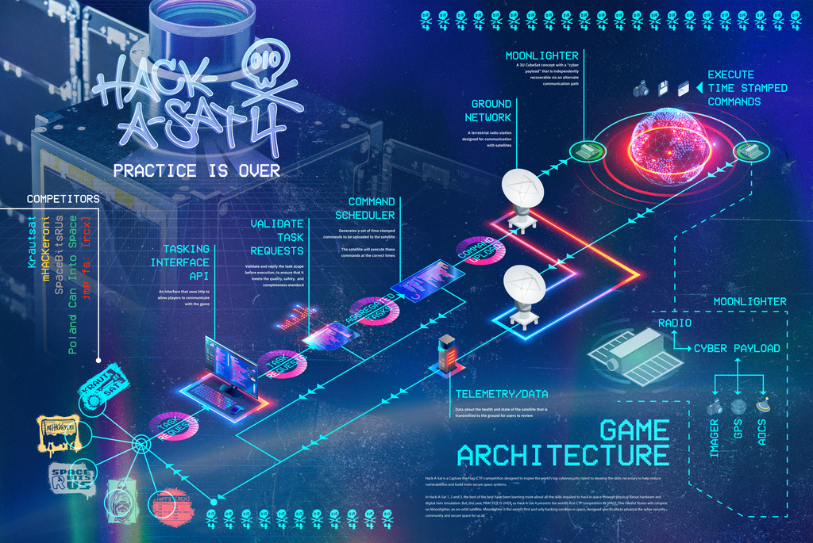

# Hack-a-Sat 4 -  2023 Final #
Distribution Statement A: Approved for public release. Distribution is unlimited. AFRL-2023-5149

This repository contains the open source release for the Hack-a-Sat 4 2023
final event.

Final scores from the event are posted at https://finals.2023.hackasat.com/

### Released artifacts include:

* Source code for all challenges
* Source code for all challenge solutions
* User Guide given to teams
* Final game data dump provided to teams (input to scoring)

### Released artifacts *do not* include:

* Infrastructure used to host and run the game
* Source code for the score board
* Source code for custom cFS and COSMOS deployments
* Source code for for visualization
* Source code for satellite emulation
* Source code or configuration for Moonlighter cyber payload

## Repository Structure ##
* [Challenge Descriptions](./CHALLENGES.md) - Descriptions for all challenges
* [challenges](./challenges/) - Source code for the ground and satellite challenges.
  - [ground_chals](./challenges/ground_chals/) - Source code for challenges that were considered running on the groundstation
  - [satellite_chals](./challenges/satellite_chals/) - Source code for challenges considered running on the satellite
    - [satellite]
* [solvers](./solvers/) - Mission Control's solutions/solvers for the challenges.
  - [ground_chals](./solvers/ground_chals/) - Solvers for challenges that were considered running on the groundstation
  - [satellite_chals](./solvers/satellite_chals) - Solvers for challenges considered running on the satellite
* [docs](./docs/) - Contains files provided to the teams during the game
* [game_data](./game_data/HAS4_FULL_GAME/) - Contains final game data and TLM dump provided to teams at the game conclusion. Used as input to scoring
* [team writeups](./team_writeups/) - Writeups about the game written by the top teams
* [discord logs](./discord_logs/) - Publicly released logs of team chats

## License ##

Files in this repository are provided as-is under the MIT license unless
otherwise stated below or by a license header. See [LICENSE.md](LICENSE.md)
for more details.

cFS are provided under the NOSA v1.3 license.

COSMOS is provided under the GPLv3 license.

OSK is provided under the LGPL license.

## Contact ##

Questions, comments, or concerns can be sent to `hackasat[at]cromulence.com`.