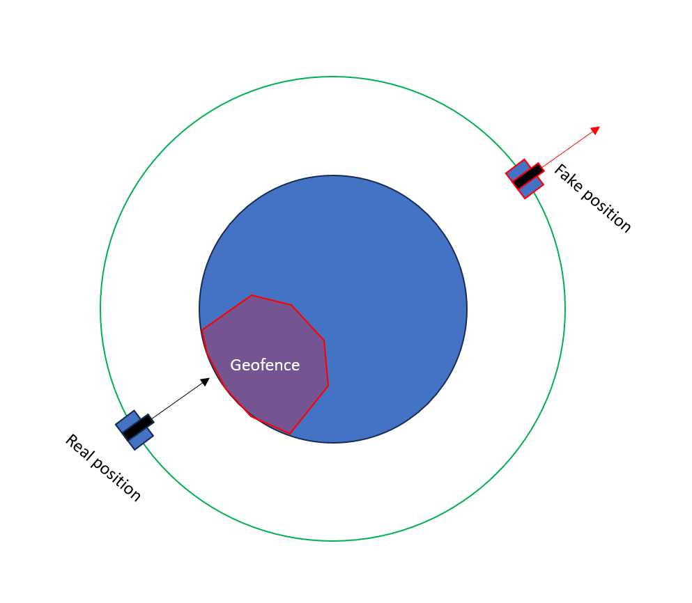

# Geofence
**Devices Involved**: GPS
**Concepts**: GPS Receiver Commands, Script Injection, Space math

Users are allowed to use scripts to speed up their interaciton with the camera. To safe guard against malfeasance developers only give them very limited access to commands generated from the scripting engine.

The geofence can be bypassed by leveraging the vulnerability used in `Christmas in Augst` to change the latitude and longitude of the GPS receiver when taking an image. Moving the satellite to be 180 degrees in true anomaly around its orbit will turn any nadir (ish) facing quaternion into a space facing quaternion and allow imaging.

